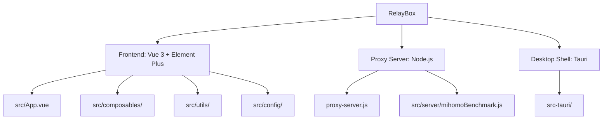

# RelayBox - Clash 链式代理配置生成器

> 一个轻量级 Web/Tauri 工具，用于整理 Clash 订阅节点、规划中转链路，并生成 Clash / Shadowrocket 兼容配置。

## 强制规范入口

后续所有 AI 或人工开发，必须先阅读并遵守 `specs/` 目录。

- 需求、架构、模块职责、数据状态、协议解析、配置生成、前端交互、运维流程，都以 `specs/` 为准。
- 只要改动影响产品行为、模块边界、数据结构、配置输出、测试命令、部署方式或用户流程，就必须同步更新对应 specs 文档。
- 如果代码和 specs 冲突，开发者必须先判断真实现状，再同步修正文档或代码，不能让冲突继续留着。
- 完成开发前必须检查 `specs/business/AI开发守则.md` 的完成清单。

## 项目愿景

RelayBox 帮用户把机场订阅节点、自建节点、落地节点和规则整理成可导入客户端的配置。核心目标是：

- 快速导入订阅、Clash YAML 或逐行节点链接。
- 支持中转模式、直连模式、订阅整理模式。
- 自动生成可验证、无悬空引用的 Clash 配置。
- 兼顾 Web 端和 Tauri 桌面端。

## 架构总览



| 模块 | 路径 | 职责 |
|------|------|------|
| 前端主应用 | `src/App.vue` | 页面组织、工作台流程、持久化、导出操作 |
| 业务组合逻辑 | `src/composables/` | 节点、订阅、配置生成等可测试逻辑 |
| 工具函数 | `src/utils/` | 节点解析、规则解析、配置校验、mihomo 客户端等 |
| 默认配置 | `src/config/defaultConfig.js` | 默认规则、订阅整理规则、Fake-IP 过滤 |
| 代理服务器 | `proxy-server.js` | 静态资源、CORS 订阅代理、测速、mihomo 接口 |
| 桌面端 | `src-tauri/` | Tauri 宿主、原生网络能力、桌面构建 |
| 测试 | `tests/` | Node.js 原生 test runner 用例 |
| 规范库 | `specs/` | 后续开发必须同步维护的项目规范 |

## 运行与开发

### 环境要求

- Node.js >= 20（Vite 7 要求 `^20.19.0 || >=22.12.0`）
- npm
- Tauri 桌面构建需要 Rust 与平台相关依赖

### 常用命令

```bash
npm install
npm run dev
npm test
npm run build
npm run verify:clash
npm run verify:all
```

- Web 前端默认地址：`http://localhost:5173`
- 本地代理服务器默认地址：`http://localhost:8787`
- 代理服务器端口通过 `PORT` 环境变量配置。

## 功能特性

- 订阅解析：支持 Base64、纯文本节点、Clash YAML。
- 协议支持：VMess、VLESS、Trojan、Shadowsocks、SSR、AnyTLS、Hysteria、Hysteria2、TUIC、SOCKS5、HTTP。
- 模式支持：中转模式、直连模式、订阅整理模式。
- 链式代理：通过 `dialer-proxy` 将落地节点挂到前置跳板组或单个跳板策略后面。
- 策略组生成：代理出口、落地组、来源组、自动选择、故障转移、负载均衡。
- 规则助手：规则候选、冲突分析、最近历史、内置常用站点。
- 节点治理：来源分组、区域分组、信息节点过滤、节点测速。
- 配置健康检查：生成后检查代理、策略组、规则引用关系。
- mihomo 校验与测速：通过本地代理服务或桌面宿主完成。

## 编码规范

- 前端使用 Vue 3 Composition API 和 `<script setup>`。
- 优先把可测试业务逻辑放到 `src/composables/` 或 `src/utils/`，避免继续膨胀 `src/App.vue`。
- YAML 输出必须走 `js-yaml`，不要手拼大段 YAML。
- 代理配置导出前必须经过 `validateClashConfig` 或同等级校验。
- 解析器新增协议时必须补测试，至少覆盖合法链接、非法端口、必要字段缺失。
- 涉及网络入口时必须保留 SSRF、CORS、请求体大小、路径穿越等安全防护。
- 改 UI 时同步检查窄屏、桌面端、按钮禁用态、状态提示。

## 测试策略

项目使用 Node.js 内置测试运行器：

```bash
npm test
```

重点测试范围：

- Clash 配置生成与策略引用
- 节点协议解析
- 订阅导入与 Clash YAML 提取
- 节点来源、信息节点过滤、节点选择
- 规则助手与默认规则
- 代理服务器安全与端点行为
- mihomo 配置校验与测速辅助逻辑

涉及配置合法性时，额外运行：

```bash
npm run verify:clash
```

发布前建议运行：

```bash
npm run verify:all
```

## AI 使用指引

开发开始前：

1. 先读 `specs/README.md`。
2. 再按任务类型读对应 specs 文档。
3. 检查当前工作区是否有用户未提交改动，不要回滚用户改动。

常见任务入口：

- 添加新代理协议：`specs/business/代理协议与配置生成规范.md`
- 修改导出 YAML：`specs/business/代理协议与配置生成规范.md`
- 调整工作台流程：`specs/business/前端交互规范.md`
- 拆分模块或重构：`specs/business/架构设计.md`、`specs/business/模块职责.md`
- 改持久化字段：`specs/business/数据模型与状态.md`
- 改代理服务器或部署：`specs/business/运维手册.md`

开发完成前：

- 运行相关测试。
- 同步更新 specs。
- 在最终说明里明确写出改了哪些 specs，或者说明本次改动不影响 specs 的理由。

## 变更记录

| 时间 | 操作 | 说明 |
|------|------|------|
| 2026-01-26 | 文档初始化 | 生成根级项目文档 |
| 2026-04-28 | 安全加固 | SSRF 防护、CORS 白名单、请求体限制、CSP 启用 |
| 2026-04-28 | 代码质量 | 提取规则解析、并发限制、订阅导入测试 |
| 2026-04-30 | 规范库补齐 | 新增 `specs/`，并把 specs 同步维护列为开发完成条件 |
