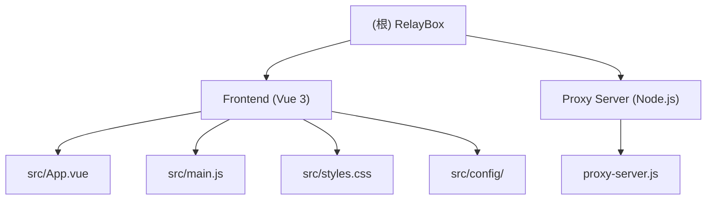

# RelayBox - Clash 链式代理配置生成器

> 一个轻量级的 Web 工具，用于自动化生成支持"中继/链式代理" (Relay/Chain Proxy) 的 Clash 配置文件。

## 项目愿景

本项目旨在帮助用户快速生成 Clash 代理配置，支持将机场订阅节点与自定义落地节点通过链式代理方式组合，实现更灵活的代理流量路由。

## 架构总览



| 模块 | 路径 | 职责 |
|------|------|------|
| 前端主应用 | `/src/App.vue` | UI 界面、节点解析、配置生成逻辑 |
| 入口文件 | `/src/main.js` | Vue 应用初始化、Element Plus 集成 |
| 样式 | `/src/styles.css` | 全局样式、主题定制 |
| 配置模块 | `/src/config/` | 默认规则、规则模板 |
| 代理服务器 | `/proxy-server.js` | CORS 代理、配置托管、节点测速 |

## 运行与开发

### 环境要求

- Node.js >= 18
- npm

### 安装依赖

```bash
npm install
```

### 开发模式

同时启动 Vite 开发服务器和代理服务器：

```bash
npm run dev
```

- 前端地址: http://localhost:5173
- 代理服务器: http://localhost:8787

### 构建生产版本

```bash
npm run build
```

### 预览构建产物

```bash
npm run preview
```

## 功能特性

### 核心功能

1. **订阅解析** - 支持 Base64 和纯文本格式的机场订阅解析
2. **多协议节点支持** - VMess、VLess、Trojan、Shadowsocks、SSR、Hysteria、Hysteria2、TUIC
3. **链式代理配置** - 自动为落地节点注入 `dialer-proxy` 配置
4. **策略组生成** - AI/Google 专线组、其他外网组、内网直连组
5. **规则模板** - 流媒体优化、游戏加速、办公直连、开发者加速、社交媒体

### 高级功能

- **节点延迟测试** - 通过 TCP 连接测试节点可达性
- **配置导入** - 支持导入现有 Clash YAML 配置
- **配置托管** - 本地服务器托管配置（10分钟有效期）
- **一键导入** - 生成 `clash://` 协议链接唤起客户端
- **订阅自动刷新** - 定时自动更新节点列表
- **节点健康监控** - 后台定期检测节点状态

## 技术栈

| 领域 | 技术 |
|------|------|
| 前端框架 | Vue 3 (Composition API) |
| UI 组件库 | Element Plus |
| 构建工具 | Vite |
| YAML 处理 | js-yaml |
| 二维码生成 | qrcode |
| 差异对比 | diff |
| 代理服务器 | Node.js http 模块 |

## 测试策略

本项目暂无自动化测试用例。

## 编码规范

- 使用 Vue 3 Composition API (`<script setup>`)
- 组件使用单一文件组件 (SFC) 格式
- 样式使用 CSS 自定义属性实现主题
- 遵循 ESLint 基础规范

## AI 使用指引

### 常见任务

1. **添加新代理协议支持**
   - 修改 `/src/App.vue` 中的 `parseProxyLine` 函数
   - 添加对应的解析函数（如 `parseSnell`）
   - 更新 `generateYaml` 中的落地节点构建逻辑

2. **添加新规则模板**
   - 编辑 `/src/config/ruleTemplates.js`
   - 添加模板对象，包含 name、icon、description 和 rules 数组

3. **修改默认规则**
   - 编辑 `/src/config/defaultConfig.js`
   - 修改 `defaultRules` 数组

4. **代理服务器功能扩展**
   - 编辑 `/proxy-server.js`
   - 添加新的 `/path` 路由处理

### 注意事项

- 代理服务器端口通过环境变量 `PORT` 配置，默认为 8787
- 配置托管有效期为 10 分钟，过期自动清除
- 节点健康状态存储在 localStorage 中

## 变更记录 (Changelog)

| 时间 | 操作 | 说明 |
|------|------|------|
| 2026-01-26 | 文档初始化 | 生成根级 CLAUDE.md 文档 |
