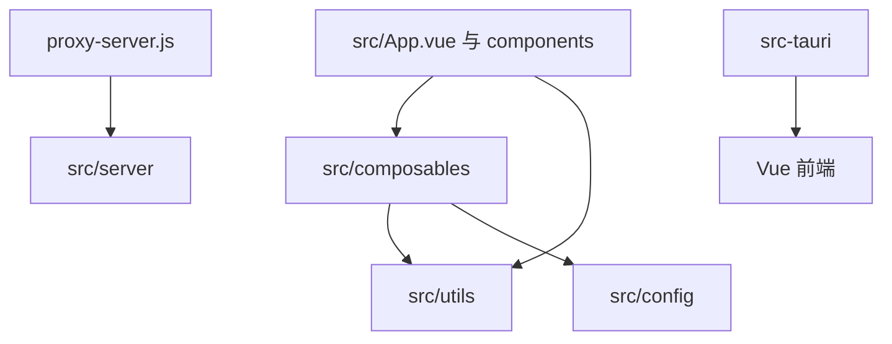
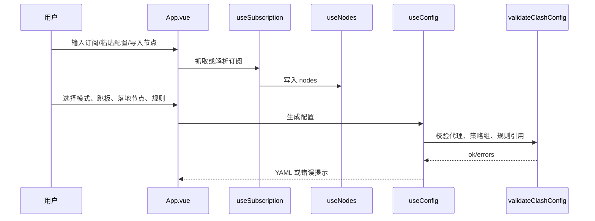

# 架构设计

## 分层原则

RelayBox 按以下边界组织代码：

## 前端架构

### UI 层

`src/App.vue` 负责页面布局、工作台状态、按钮事件、弹窗和用户反馈。新增复杂逻辑时不要继续塞进 `App.vue`，优先拆到：

- 业务状态和流程：`src/composables/`
- 纯函数和解析：`src/utils/`
- 独立展示组件：`src/components/`

### Composables 层

Composables 负责可组合业务能力：

- `useConfig`：配置生成、落地节点校验、导出前校验。
- `useSubscription`：订阅抓取、粘贴导入、Clash YAML 提取、融合导入。
- `useNodes`：节点列表、搜索、筛选、分组、选择、测速。
- `useNodeParams`：节点字段补全。

Composables 可以依赖 utils 和 config，不应依赖具体 DOM。

### Utils 层

Utils 放纯函数或低副作用工具：

- 解析器。
- 配置校验。
- 规则分析。
- 节点清洗。
- 来源分组。
- mihomo API 客户端。

新增工具函数必须能单测时优先单测。

## 服务端架构

`proxy-server.js` 是本地 HTTP 服务入口，承担：

- 静态资源服务。
- `/fetch` 订阅代理。
- `/ping` 节点 TCP 可达性测试。
- `/mihomo/*` 相关校验和测速接口。

服务端新增能力时，应优先把可测试逻辑抽到 `src/server/`，不要让 `proxy-server.js` 无限变大。

## 桌面端架构

Tauri 负责桌面壳能力：

- 原生订阅抓取。
- 原生节点 ping。
- 桌面端状态保存。
- 文件保存与平台集成。

涉及网络能力时，必须同时确认 Web 端和桌面端行为，不允许只测其中一边就合并。

## 数据流

## 安全边界

代理服务器必须保留：

- URL 协议限制，只允许 `http:` / `https:`。
- 私有地址、保留地址、localhost 拦截。
- DNS lookup 后再次检查，防 DNS rebinding。
- CORS 白名单。
- 请求体大小限制。
- 静态文件路径穿越防护。
- 重定向次数限制。

## 文档同步要求

改动以下内容时必须更新本文件：

- 新增主要模块或删除主要模块。
- 调整前端、服务端、桌面端职责边界。
- 改变配置生成主流程。
- 新增网络入口或安全边界。
